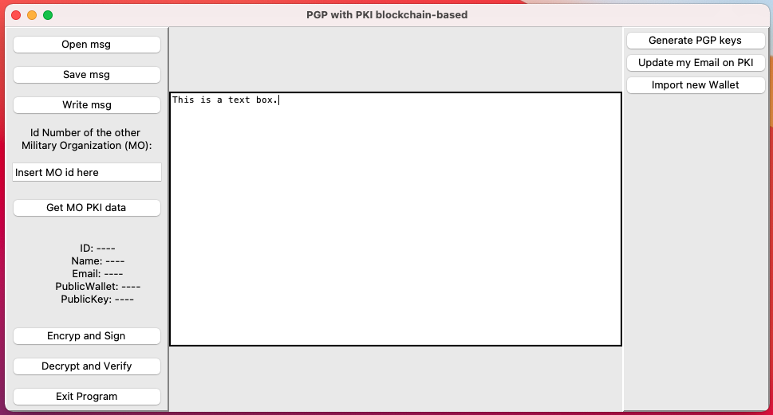

# PGP-PKI

This repository contains a Proof of Concept in an encrypted messaging system in which participants' public keys are held in an smart contract stored in a blockchain (private or public).

## Installation (smart contract)

The smart contract [PKIcontract.sol](https://github.com/julio-cesar-leitao/PGP-PKI/blob/main/PKIcontract.sol) in the builder needs an address (or more) related to an account that can add more participants, these accounts are technical users. `Add to line 30` an address from your wallet. `Deploy this contract` in a blockchain (and `store` the address of that instance of the contract deployed), this can be done with [Remix](http://remix.ethereum.org/).

Note that after creating an account, the only person who can modify the elements of the structure that represents it is the user who has the private key referring to the public address that is in the variable `addr`. Thus, even if someone steals the private keys of a technical user's account, that person will not be able to modify the rest of the contract data, therefore, the public keys of the participants are safe.

## Installation (endpoint app)

Each end user will use an instance of the application located in the [MOnewUser](https://github.com/julio-cesar-leitao/PGP-PKI/tree/main/MOnewUser) directory. This application contains folders:
1. Messages: To store incoming and outgoing messages.
2. PGP: To store cryptographic public and private key pairs for the PGP protocol, in the example RSA with 2024 bits was used.
3. Wallet: Stores the public and private keys of the wallets.
4. env: It is a virtual environment with program dependencies.

The only ones who can modify public keys are their owners.

Specify the blockchain `url` and `contract address` (previously deployed) in the first lines of `main.py`.

In a terminal (or powershell) go to `PGP-PKI` folder:
1. (Optional) Create and start a virtual enviroment
2. Install requirements (in this case is just web3.py):
```
$ pip install -r requirements.txt
```

Go to `MOnewUser` folder:

3. Run the app:
```
$ python3 main.py
```

This UI screen should appear:


# Example

A private blockchain network was created to test the application, in it there are 2 Military Organizations (MO) using the DApp: MOJulio and MOricardo. PGP (in this case RSA) and wallet public and private keys are already configured in their respective folders.

To run the example, do the following:

1. Run the private blockchain from the `PB_Private-Blockchain` directory:
```
$ geth --datadir './Node01' --port 30301 --nodiscover --http --http.port '8545' --http.corsdomain '*' --networkid 1234 --allow-insecure-unlock console 2> >./Node01/get.log
```
2. Run the application from the `PB_MOJulio` directory:
```
$ python3 main.py
```
3. Run the application from the `PB_MORicardo` directory:
```
$ python3 main.py
```

## License
[MIT](https://choosealicense.com/licenses/mit/)
